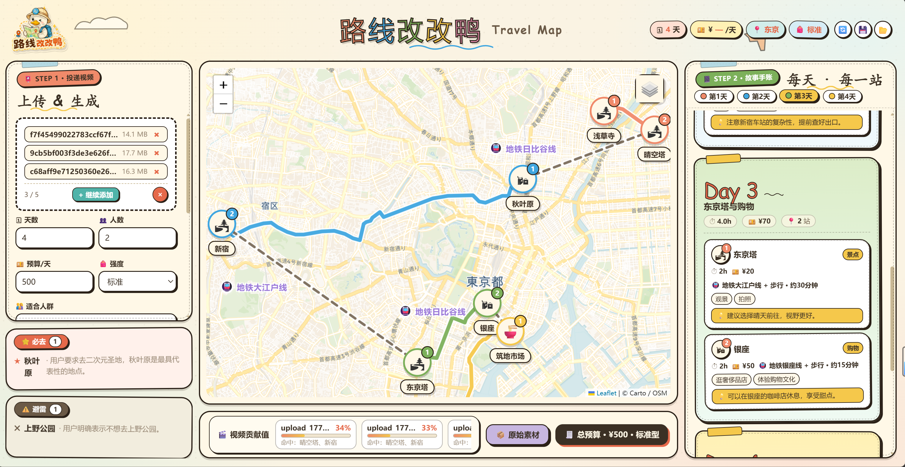
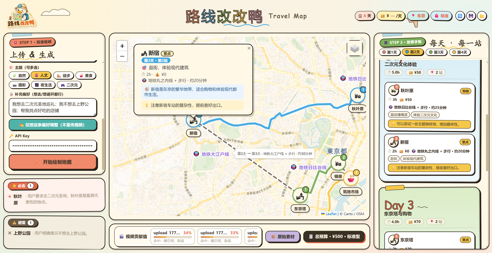

#  路线改改鸭

> **把抖音视频里的"种草"，自动拼成可视化的旅行地图。**
> 上传一段抖音/B站旅游视频 → 自动转写 + 关键帧 OCR + LLM 规划 → 输出按天分色路线 + 站点 emoji 标记 + 评分卡 + 必去/避雷清单。





---

## ✨ 功能一览

- 🎬 **多模态视频解析**：yt-dlp 下载 + Whisper 转写 + 关键帧 OCR + 视频元数据
- 🧠 **LLM 路线规划**：兼容 OpenAI 接口，输出结构化攻略（人群/预算/强度可定制）
- 🗺 **Folium + OSM 地图**：每个站点 emoji 大圆贴纸 + 永久地名标签 + 跨天交通方式标注
- 🚇 **路线优化**：贪心最近邻自动重排，每天不交叉、按地铁/公交线路串联
- 📍 **地理编码**：高德 / LLM / Nominatim 三级兜底自动补 lat/lng
- ✍️ **一句话改路线**：「删掉武康路，加上田子坊」直接重算
- 📦 **一键打包**：导出 zip（含 guide.json/md、map.html、关键帧）

---

## 🚀 快速开始（3 步）

### 1. 安装 Python 3.10+

下载 https://www.python.org/downloads/ —— 建议 3.10 / 3.11 / 3.12。
安装时勾选 **"Add Python to PATH"**。

> 不需要单独安装 FFmpeg，依赖里的 `imageio-ffmpeg` 会自动下载二进制。

### 2. 创建虚拟环境 + 装依赖

打开终端（Windows 用 PowerShell / CMD / Git Bash 都行），cd 到项目目录：

**Windows：**
```cmd
python -m venv .venv
.venv\Scripts\activate
pip install -r requirements.txt
```

**Mac / Linux：**
```bash
python3 -m venv .venv
source .venv/bin/activate
pip install -r requirements.txt
```

首次安装约 200MB（含 numpy、opencv、curl-cffi 等）；如有可选包失败可忽略。

### 3. 配置 API Key（任选一种）

本工具支持任何兼容 OpenAI Chat Completions + Whisper 的接口（OpenAI 官方、`openai-next.com`、`vectrust` 等）。

**方式 A · 环境变量（推荐）：**

Windows PowerShell：
```powershell
$env:VECTRUST_API_KEY = "sk-你的key"
$env:OPENAI_BASE_URL  = "https://api.openai-next.com"  # 可选
$env:OPENAI_MODEL     = "gpt-4o-mini"                  # 可选
```

Mac / Linux：
```bash
export VECTRUST_API_KEY="sk-你的key"
export OPENAI_BASE_URL="https://api.openai-next.com"
export OPENAI_MODEL="gpt-4o-mini"
```

**方式 B · 网页填入**：启动后在左侧表单"🔑 API Key"输入框填即可。

### 4. 启动

**Windows**：双击根目录的 `run.bat`
**Mac / Linux**：`bash run.sh`

或手动：
```bash
python server.py
```

终端看到这一行说明启动成功：
```
🌐 http://127.0.0.1:5000
```

浏览器打开 **http://127.0.0.1:5000** 即可。

---

## 📖 使用方法

打开页面后默认展示 **东京/长三角等样例攻略**，可以先看一下界面布局：

```
┌──────────────────────────────────────────────────────────┐
│ 🧭 抖音旅行图鉴       Travel Map ✦      🗓 💴 📍 贴纸     │  顶部
├────────┬──────────────────────────────┬──────────────────┤
│ 📮 投递 │                              │ 📔 故事手账       │
│ 上传表单 │       🗺 Folium 地图        │  Day 1 卡片       │
│ + 参数  │  emoji 贴纸 + 永久地名标签   │  Day 2 卡片       │
│        │  按天彩色路线 + 跨天交通标签  │  Day 3 卡片       │
│ ⭐ 必去 │                              │   ...            │
│ ⚠️ 避雷 │                              │                  │
├────────┴──────────────────────────────┴──────────────────┤
│ 🚆 交通 · 🍜 美食 · 🎒 提醒  📦 原始素材  🧾 总预算 ¥xxxx │  底部
└──────────────────────────────────────────────────────────┘
```

### 三种典型用法

#### 🅰 只看现有样例（无需 API Key）
直接看默认页 → 操作地图、查看行程卡。

#### 🅱 用一句话改路线（需 API Key）
点击右上角的「🧾 总预算」旁边或左侧 ⭐避雷区域操作。**(当前版本入口在「📦 原始素材」按钮旁边的对话区，未来可扩展)**

#### 🅲 从视频生成新攻略
1. 左侧「📮 STEP 1 · 投递视频」拖入或选择 MP4
2. 设置天数 / 人数 / 预算 / 强度
3. 填 API Key（或已配环境变量则留空）
4. 点 **「✏️ 开始绘制地图」**
5. 进度条会显示：下载→提取音频→Whisper转写→关键帧→OCR→LLM→路线优化→渲染
6. 约 1-3 分钟后地图、行程卡、必去/避雷全部刷新

> ⚠️ **抖音直链下载受反爬限制**：建议用 https://snaptik.app 等工具先下载 MP4，再上传本地文件。

---

## 📁 目录结构

```
路线改改鸭-发布版/
├── server.py             # Flask 后端入口
├── pipeline.py           # 视频→攻略 流水线（ffmpeg/yt-dlp/whisper/LLM）
├── visualize.py          # Folium + OSM 地图渲染
├── geocode.py            # 三级地理编码（AMap > LLM > Nominatim）
├── templates/
│   └── index.html        # 主页面（横版 bento 布局，手绘风）
├── static/
│   ├── app.js            # 前端逻辑
│   └── logo.png
├── output/               # 生成结果（首次启动加载这里的 guide.json）
│   ├── guide.json        # 样例数据
│   ├── guide.md
│   ├── map.html
│   ├── frames/           # 关键帧截图
│   └── geocache.json     # 地理编码缓存
├── try.mp4               # 演示视频（4 分钟东京 vlog）
├── requirements.txt
├── README.md
├── run.bat               # Windows 启动
└── run.sh                # Mac/Linux 启动
```

---

## ⚙️ 高级配置

### 环境变量

| 变量 | 默认 | 说明 |
|---|---|---|
| `VECTRUST_API_KEY` 或 `OPENAI_API_KEY` | —— | LLM + Whisper 必填 |
| `OPENAI_BASE_URL` | `https://api.openai-next.com` | API base，可改 `https://api.openai.com` |
| `OPENAI_MODEL` | `gpt-4o-mini` | Chat 模型名 |
| `AMAP_KEY` | —— | 高德地图 Web Key（可选，国内地理编码更准） |
| `HOST` | `127.0.0.1` | 监听 IP |
| `PORT` | `5000` | 监听端口 |

### 切换模型 / 接口

直接改环境变量 `OPENAI_BASE_URL` 和 `OPENAI_MODEL`，再启动即可。

### 长视频 Whisper API 超时
`pipeline.py` 已实现：先整段提交，超时（524/504/timeout）自动切 60 秒小段重试。仍失败时回退本地 `faster-whisper`（首次会下载 ~500MB 模型）。

---

## 🐛 常见问题

**Q：打开页面是空白 / 地图不显示？**
A：浏览器按 `Ctrl + F5` 强刷一次。

**Q：上传时报 "缺少 ffmpeg"？**
A：`pip install imageio-ffmpeg` 重新安装；首次启动会自动复制 `ffmpeg.exe` 到 venv Scripts 目录。

**Q：Whisper API 524 网关超时？**
A：长视频已自动切片重试；若全部失败请检查 API Key 余额 / 网络代理。

**Q：抖音直链下载失败？**
A：抖音反爬严格，用 https://snaptik.app 等先下载 MP4，再选择"本地视频"上传。

**Q：站点地理编码不准 / 缺坐标？**
A：注册高德 Web Key 设置 `AMAP_KEY` 环境变量；或直接编辑 `output/guide.json` 手动改 lat/lng。

---

## 📜 License

仅供个人学习 / 评审 / Demo 演示使用。所引用模型、地图、视频版权归原作者所有。


