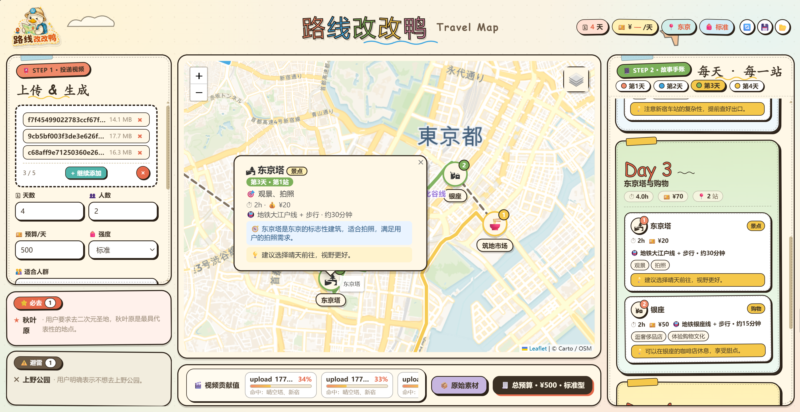

# “AI+旅行”：「路线改改鸭」期末报告

第19组 金之杭 12525032

## 1. 小组项目简介

「路线改改鸭」的定位是：**把短视频里的“种草”，自动拼成可视化的旅行地图**。参考项目 README 和技术文档中的介绍，它的核心目标是让博主视频里的旅行推荐从“看起来想去”，变成用户可以直接参考和修改的路线初稿。

用户上传抖音、B 站或本地旅行视频后，系统会进行视频解析、语音转写、关键帧识别和 AI 路线规划，最后输出地图路线、每日行程卡片、预算、必去地点和避雷地点。项目希望解决的问题是：短视频很适合激发旅行兴趣，但信息碎片化，用户很难直接判断地点之间的距离、交通和游玩顺序。

项目地址：https://github.com/Liuyiyang1118/change-change-duck

小组项目的主流程如下：

```text
上传旅行视频
→ Whisper / OCR / 关键帧提取视频信息
→ LLM 生成结构化旅行攻略
→ Folium 地图展示路线
→ Step 2 故事手账展示每日行程
→ 用户继续用一句话修改路线
```

项目已有功能包括：

- 多视频上传和解析。
- AI 自动生成旅行路线。
- Folium + Leaflet 地图展示地点和路线。
- 按天展示故事手账。
- 生成必去和避雷清单。
- 支持一句话修改路线。
- 支持保存当前攻略、重置样例、打开上次保存。

下面是小组项目已有的效果截图。

### 1.1 主界面效果


主界面采用手账风格，左侧是视频上传和旅行参数，中间是地图，右侧展示每天的行程卡片。用户可以看到路线整体分布，也可以查看每一天每一站的具体安排。

### 1.2 地图与路线展示



地图区域会展示 AI 生成的旅行路线和地点分布。相比纯文本攻略，地图能更清楚地表现地点之间的距离和动线关系。

### 1.3 每日攻略卡片


右侧的故事手账会按天展示行程，每个地点包含时间、预算、交通、推荐活动、评分和提示信息，方便用户快速判断路线是否合理。

## 2. 旅行记忆闭环的实践拓展

在小组项目基础上，我进一步加入了「旅行后记录」功能。原项目主要解决“旅行前如何生成路线”，这部分实践希望补上“旅行后如何复盘，并让 AI 学习个人偏好”这一环。

项目地址：https://github.com/MrEricKing/change-change-duck-EricKing

新增后的使用流程变成：

```text
旅行前：上传视频，生成路线
旅行中：按照路线实际游玩
旅行后：记录真实体验
沉淀后：AI 提炼历史偏好
下一次：生成路线时选择历史偏好作为参考
```

这个功能让项目不只是一次性攻略生成器，而是能逐渐积累个人旅行经验的工具。

### 2.1 新增 Step 3：旅行后记录

我将原本的三栏界面扩展为四栏，在右侧新增 `STEP 3 · 旅行后记录`。这一栏用于记录真实游玩后的信息，包括：

- 实际去了哪些地方
- 哪些地方没去成
- 新增发现
- 实际花费
- 实际节奏
- 真实体验
- 游玩照片

这里记录的是用户真实经历，和 AI 旅行前生成的计划区分开。


修改后的主界面如下：


### 2.2 历史偏好库

旅行后记录可以通过 AI 提炼成历史偏好。例如用户在复盘中写到“不喜欢一天跨太多区域”“下午需要休息”“更喜欢城市漫步和本地小吃”，系统会把这些内容整理成可复用的偏好。

这些偏好会保存到历史偏好库里。下一次规划路线时，用户可以选择是否使用这些偏好。

这个设计的重点是：历史偏好不会自动影响所有路线，而是由用户主动选择。

### 2.3 从历史偏好中选择

在 Step 1 中，我加入了“从历史偏好中选择”。用户可以勾选某一次旅行复盘中提炼出的偏好，然后再让 AI 参考这些偏好生成或修改路线。

例如：

```text
已选择：东京四日游复盘
偏好内容：减少跨区折返、每天 3-4 个主要地点、下午留低强度活动
```

这样可以让 AI 在规划江浙沪路线、日本路线或其他路线时，参考用户过去真实旅行中的习惯。

### 2.4 生成旅行后攻略

旅行结束后，系统可以根据用户的真实记录生成一份“旅行后攻略”。这份攻略不是原计划，而是结合真实体验后的版本。

它可以包括：

- 哪些地方实际值得去
- 哪些安排需要调整
- 哪些地点和视频推荐有差距
- 实际预算和节奏
- 下次旅行建议

这让项目从“旅行前规划”扩展到了“旅行后内容整理”。

### 2.5 评价投递视频

我还加入了视频评价功能，用于比较“视频推荐”和“真实体验”之间的差异。

系统会根据原始视频素材、AI 生成路线和旅行后记录，输出类似下面的评价：

- 视频推荐比较靠谱的地方
- 视频滤镜较重或信息不足的地方
- 实地体验超出预期的地方
- 下次规划应该如何修正

这个功能可以帮助用户判断短视频种草内容是否真的适合实际旅行。

## 3. 使用效果说明

整体使用后，我认为主要带来了三个变化。

第一，路线生成更个性化。原系统主要根据视频和当前填写的偏好生成路线；加入历史偏好后，AI 可以参考用户过去的真实体验，例如不喜欢赶路、不喜欢排队、更喜欢同一区域慢慢玩。

第二，旅行体验可以沉淀下来。旅行后记录让用户不只是“用完攻略就结束”，而是可以把真实体验保存下来，形成下一次旅行的参考。

第三，短视频推荐可以被评价。旅行短视频往往只展示最吸引人的片段，但真实旅行还要考虑距离、排队、体力和预算。视频评价功能可以帮助用户反思视频推荐是否靠谱。

### 3.1 效果案例一：用日本旅行反馈调整江浙沪路线，并评价日本投递视频

这一案例用于展示历史偏好如何跨目的地发挥作用。日本旅行反馈中沉淀出的偏好，不是把日本地点加入江浙沪路线，而是提取出更抽象的旅行习惯，例如减少跨区域折返、每天控制主要地点数量、下午留出低强度时间、避免排队过久的网红点。

同时，这条日本旅行后记录也可以用来评价日本投递视频：哪些推荐和真实体验一致，哪些推荐只适合短视频展示，哪些信息在视频里没有充分说明。

- 使用的历史偏好：日本 / 东京旅行后记录。主要反馈是东京跨区移动比视频里看起来更耗体力，热门地点排队和人流明显影响体验；更适合每天控制 3-4 个主要地点，把同一区域的城市漫步、本地小吃和低强度活动串联起来。
- 旅行后记录与历史偏好截图：


- 视频评价截图：


- 被调整的路线：江浙沪 / 长三角路线
- 主要变化：
  - 调整后的江浙沪路线不再只追求热门点堆叠，而是减少同城多点赶场、夜间继续赶场和隐藏交通成本。
  - 每天主要地点数量被压缩，下午增加了低强度活动或休息时间，避免连续高强度移动。
  - 部分排队成本高、只适合短时间打卡的地点被弱化，替换为更适合慢游、散步和体验本地生活的安排。

文字版对比如下：

| 天数 | 调整前路线 | 调整后路线 | 变化说明 |
|---|---|---|---|
| 第 1 天 上海 | 外滩 → 南京路步行街 → 豫园 & 城隍庙 → 陆家嘴 · 东方明珠 → 黄浦江夜游船 | 豫园 · 九曲桥湖心亭 → 外滩观景平台 · 陈毅广场 → 陆家嘴环形天桥 · 三件套同框点 → 南京路步行街 · 南翔馒头店总店 | 保留上海最有代表性的老城厢、外滩和陆家嘴，但删去黄浦江夜游船，把晚间继续赶场改成更轻的步行和小吃收尾。 |
| 第 2 天 苏州 | 拙政园 → 苏州博物馆 → 平江路历史街区 → 山塘街 | 拙政园 · 听雨轩 → 苏州博物馆 · 贝聿铭展厅 → 平江路 · 猫空书店沿河段 | 原路线已经在苏州城内，但一天四个热门点仍偏满；调整后去掉山塘街，把下午留给平江路慢游。 |
| 第 3 天 杭州 | 西湖（断桥 - 苏堤） → 灵隐寺 → 河坊街 → 西溪湿地 | 灵隐寺 · 大雄宝殿 → 西湖 · 断桥残雪碑亭 → 河坊街 · 孙奶奶葱包桧 | 删除和主线距离更分散的西溪湿地，把当天集中在灵隐寺、西湖、河坊街三个核心点，降低市内换乘和体力消耗。 |
| 第 4 天 南京 | 中山陵 → 南京总统府 → 夫子庙 · 秦淮河 → 1912 街区 | 中山陵 · 祭堂 → 1912 街区 · 张嘉佳餐厅 → 总统府 · 煦园 | 原路线把历史景点、夜游和街区都塞进一天；调整后弱化夫子庙夜游，把总统府和 1912 这类相近区域组合得更清楚。 |
| 第 5 天 无锡 | 鼋头渚 → 惠山古镇 → 三凤桥（无锡特色晚餐） | 鼋头渚 · 太湖仙岛码头 → 三凤桥 · 总店 → 惠山古镇 · 寄畅园 | 站点数量基本不变，但地点更具体；从“泛景点名称”变成码头、总店和园林点位，方便真实执行和复盘。 |

整体来看，这次调整没有把日本旅行中的地点迁移到江浙沪，而是迁移了更抽象的旅行偏好：降低站点密度、减少赶场和隐藏交通成本、把热门点放在上午、下午转向慢游和本地体验。这个结果更能体现历史偏好库的价值，因为 AI 学到的是“我怎样旅行更舒服”，而不是简单复制过去去过的地方。

- 视频评价结论：
  - 日本投递视频适合作为灵感来源，推荐的浅草、涩谷、原宿等地点本身具有参考价值。
  - 视频弱化了交通时间、步行距离和排队成本，让路线看起来比真实体验更轻松。
  - 真正用于规划时，不能直接照搬视频顺序，需要结合体力、区域距离和预约条件重新组织路线。

### 3.2 效果案例二：用江浙沪旅行反馈调整日本路线，并评价江浙沪投递视频

这一案例用于展示多城市旅行中的经验如何迁移到日本路线中。江浙沪复盘中关于跨城、交通、体力和节奏的反馈，可以帮助日本路线减少过密安排，让行程更符合用户真实偏好。

同时，这条江浙沪旅行后记录也可以用来评价江浙沪投递视频：视频推荐是否过于集中在热门打卡点，是否忽略交通时间、排队成本和体力消耗，以及哪些内容仍然具有参考价值。

- 使用的历史偏好：江浙沪 / 长三角旅行后记录。主要反馈是多城市路线里“高铁时间短”不等于“真实移动轻松”，进出车站、寄存行李、换乘和入住酒店都会消耗隐藏时间；更适合一天一个主区域，上午安排核心景点，下午安排低强度街区、小吃、咖啡或生活感体验。

- 旅行后记录与历史偏好截图：


- 视频评价截图：


- 被调整的路线：日本 / 东京路线
- 主要变化：
  - 调整后的东京路线没有盲目增加景点，而是把原本分散的热门点重新按区域和交通线组织。
  - 原路线中“秋叶原 → 新宿”“筑地市场 → 台场”这类跨度较大的组合被拆开，改成秋叶原周边、新宿区域、筑地-银座-东京塔这类更顺的日程。
  - 每天控制在 2-3 个主要地点，并加入神社、庭园、展望室、市场和商圈等低强度体验，让路线更适合真实执行。

文字版对比如下：

| 天数 | 调整前东京路线 | 调整后东京路线 | 变化说明 |
|---|---|---|---|
| 第 1 天 东部东京 | 浅草寺 → 晴空塔 | 浅草寺 → 晴空塔 | 原路线本身已经是同一区域内的合理组合，因此调整后保留不动，只把主题明确为“东部下町：传统寺庙与现代地标”。这说明 AI 不是机械改动，而是保留已经顺路的安排。 |
| 第 2 天 秋叶原周边 | 秋叶原 → 新宿 | 秋叶原 → 神田明神 | 原路线从秋叶原跳到新宿，跨区移动较大；调整后保留二次元核心点秋叶原，并加入步行可达的神田明神，让一天更集中，也给高刺激商业街区之后留出安静休憩。 |
| 第 3 天 新宿区域 | 东京塔 → 银座 | 新宿御苑 · 大木户门 → 歌舞伎町一番街 → 东京都厅 · 展望室 | 原路线把东京塔和银座放在一起，主题不够清晰；调整后把前一天被移出的新宿单独成日，从庭园、街区到免费展望室，形成同一区域内的慢游闭环。 |
| 第 4 天 中央东京 | 筑地市场 → 台场 | 筑地市场 · 场外市场 → 银座 · 和光本馆 → 东京塔 · 大展望台 | 原路线从筑地跨到台场，交通和体力成本较高；调整后沿筑地、银座、东京塔串联，保留美食、购物和地标，但删去跨湾区移动，收尾更顺。 |

整体来看，江浙沪反馈迁移到日本路线后，AI 学到的不是“把长三角地点放进东京”，而是把多城市旅行中的经验转化为东京规划原则：按区域组织路线、减少隐藏交通成本、避免一天跨太多大区，并主动判断哪些原安排已经足够顺路、哪些需要拆分重组。这样调整后的东京路线更像真实可执行的自由行路线，而不是短视频热门点清单。

- 视频评价结论：
  - 江浙沪投递视频适合作为灵感来源，上海、苏州、杭州、南京、无锡的代表性地点本身有参考价值。
  - 视频低估了跨城换乘、行李、进出车站、排队和夜游体力成本，让多城市路线看起来比真实执行更轻松。
  - 真正用于规划时，需要把热门点按城市和区域重新分组，并主动删掉一部分高排队、高赶路、只适合短视频展示的安排。

## 4. 个人思考

完成这部分实践后，我觉得这个项目最有价值的地方，不只是“AI 能生成攻略”，而是把旅行决策从一次性生成，变成了可以反复修正的循环。

短视频适合提供灵感，但它天然会压缩时间和成本。视频里一个镜头就能从浅草切到涩谷，从上海切到苏州，但真实旅行里还要考虑步行距离、换乘、排队、行李、体力和当天情绪。原来的系统已经能把视频内容整理成路线，这一步解决的是“从碎片信息到结构化攻略”的问题；我增加的旅行后记录，想解决的是“结构化攻略是否真的适合我”的问题。

两个案例给我的启发是，历史偏好真正有用的地方，不是把去过的地点复制到下一条路线里。日本旅行反馈用于调整江浙沪路线时，AI 学到的不是“去浅草寺”，而是“不要一天塞太多点、下午保留低强度活动、避免只适合拍照的高排队景点”。江浙沪反馈用于调整东京路线时，AI 学到的也不是“去西湖或平江路”，而是“按区域组织路线、减少隐藏交通成本、保留已经顺路的安排、拆开跨度过大的组合”。

这让我意识到，RAG 不一定只能用于检索外部知识库，也可以用于检索个人经验库。对旅行这种高度个性化的场景来说，个人经验有时比通用攻略更重要。别人觉得“充实”的路线，我可能觉得太赶；别人觉得“必打卡”的地方，我可能会因为排队和人流而降低体验。把这些真实感受沉淀下来，再让 AI 在下一次规划时参考，路线才会逐渐变得更像“我的路线”。

同时，这个过程也不是完全交给 AI。用户仍然要决定哪些历史偏好要被选中，哪些建议要采纳，哪些地方只是视频灵感而不是实际行程。对我来说，这部分个人工作量主要体现在：把旅行体验拆成可记录的信息，判断哪些反馈可以迁移到下一次路线，并用两个方向的案例检验这种迁移是否合理。

## 5. 不足与改进

当前版本已经能展示“旅行前生成路线 - 旅行后记录 - 历史偏好反哺规划”的闭环，但仍然有一些不足。

第一，历史偏好库还比较轻量。现在的偏好主要来自文本复盘，并保存在本地文件中，还不能很好地区分“长期稳定偏好”和“某次旅行的偶然感受”。例如一次旅行因为下雨而不喜欢户外活动，不一定代表以后都应该避开户外。

第二，旅行后记录仍然依赖用户主动填写。用户写得越具体，视频评价和偏好提炼越准确；如果只写“还不错”“有点累”，AI 能提炼出的内容就会比较泛。后续可以通过更结构化的表单降低记录成本，比如让用户直接选择“太赶 / 刚好 / 太松”“排队可接受 / 不可接受”“愿意再次去 / 不推荐”。

第三，照片目前主要作为素材保存，还没有真正参与理解。旅行照片其实可以帮助判断用户真实停留过哪些地方、偏好什么类型的场景、哪些地点更值得保留。如果加入图片理解，就可以让旅行后记录更图文并茂，也更符合期末报告中“图文展示”的要求。

第四，路线调整还需要更明确地展示“为什么这样改”。现在报告中需要我用文字解释前后变化；如果系统能自动生成“调整依据”，例如“因历史偏好提到不喜欢跨区移动，所以将秋叶原和神田明神组合”，展示效果会更直观。

后续可以优先做几项比较实际的改进：

- 让用户编辑、删除、合并历史偏好，避免偏好库越来越乱。
- 在每次路线调整后自动生成一段“调整说明”，方便截图和写报告。
- 给照片加入基础识别能力，用照片辅助生成旅行后攻略。
- 把旅行后攻略做成更完整的图文游记，而不只是 Markdown 文本。
- 区分短期反馈和长期偏好，让 AI 不会过度学习某一次特殊经历。

## 6. 总结

小组项目「路线改改鸭」实现了从旅行短视频到地图路线和攻略卡片的生成。我在此基础上加入旅行后记录、历史偏好库、旅行后攻略和视频评价，希望让系统从一次性攻略生成器，变成可以复盘和积累经验的旅行助手。

通过这次实践，我对 AI+X 的理解也更具体了：AI 不只是一个生成答案的工具，更适合放在一个有反馈的流程里。旅行前，它可以整理短视频信息并生成路线；旅行后，它可以帮助复盘真实体验、评价视频内容、提炼个人偏好；下一次规划时，它再把这些经验带回路线生成中。这样的循环，才更能体现“会用 AI”和“有自己的思考”。
